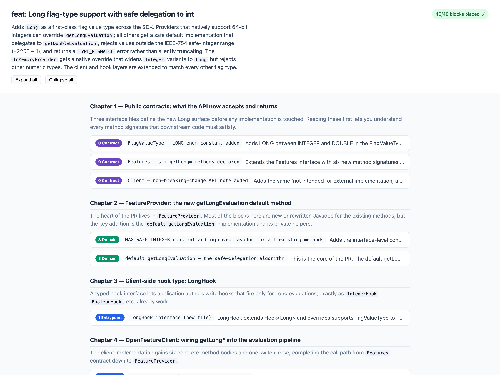

# ncr — narrative code review

**Turn a PR into a story you read outside-in — call-path chapters, explained, instead of
alphabetical files.**

[](https://github.com/justinabrahms/ncr/actions/workflows/ci.yml)
[](LICENSE)

`ncr` takes a GitHub PR and produces a single HTML page that reorders the diff into
**"chapters" that follow call paths from the outside in** — API contract → entrypoint →
application → domain → adapters — each with a plain-language explanation and the code
inline. You read the request before the database column that serves it.



**[See a live example →](https://justinabrahms.github.io/ncr/)** — a rendered review you can
click through in your browser, no install required.

## Why

Every review tool shows a diff as files in alphabetical order, hunks top to bottom. For a
300–3,000 line change that means you read `db/migrations/…` before you know what an order
even is, related changes (handler → service → repo) are scattered across the file list, and
you rebuild the architecture in your head every time — bottom-up, which is backwards from
how you'd want to *learn* the change.

`ncr` treats the diff as a **narrative**:

1. **Outside-in.** Start at the contract/entrypoint (the payload, the route, the command),
   then descend into application logic, domain, and finally adapters (DB, clients,
   migrations). You never meet a dependency before its consumer.
2. **Call-path chapters.** One coherent story per capability: `POST /orders` →
   `OrderService.place` → `OrderRepo.insert`.
3. **Progressive disclosure.** Each node opens with a one-line summary; expand for the
   explanation and the diff (with context + syntax highlighting). You pick your depth.

It's an **explainer, not a reviewer** — it tells you what changed and how the pieces
connect, and leaves the judgment to you.

## Install

```sh
brew install justinabrahms/tap/ncr
```

…or `go install github.com/justinabrahms/ncr@latest`, or grab a prebuilt binary from
[Releases](https://github.com/justinabrahms/ncr/releases). You'll need the
[`gh`](https://cli.github.com/) CLI (authenticated) and an `ANTHROPIC_API_KEY`.

## Usage

```sh
ncr owner/name 812              # build the review, serve it locally, open the browser
ncr owner/name 812 --static     # write out/review.html and exit (no server)
```

Serving is the default (it's where inline commenting will live). Local render with no
GitHub/API: `ncr --diff some.diff --plan plan.json`. Flags, the pipeline, and the code
layout are in [CONTRIBUTING.md](CONTRIBUTING.md).

## Nothing gets forgotten

The reordering is LLM-driven, but the model is **not trusted with completeness or with the
code text.** A deterministic indexer splits the diff into stable-ID'd blocks; the model only
references those ids; a deterministic reconciler proves by set-equality that every block was
placed (auto-repairing any miss into a visible "Unplaced" section), and code is rendered
verbatim from the index. So a model can't silently drop, truncate, or alter a hunk. See
[`docs/completeness.md`](docs/completeness.md).

## More

[CONTRIBUTING.md](CONTRIBUTING.md) covers building, flags, and the pipeline. Design notes are
in `docs/` (`design.md`, `completeness.md`, `ingest.md`, `schema.md`); the language choice is
in `docs/adr-001-go-cli.md`.
